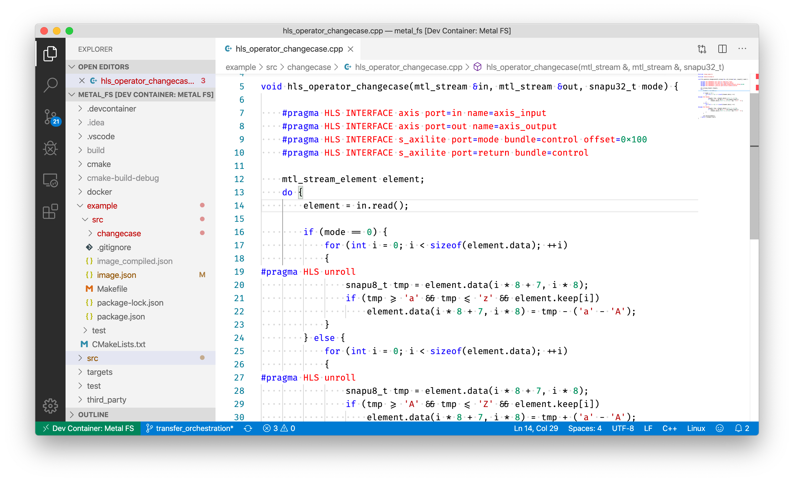

# Docker-based Development Environment

## Docker Images

The following Docker images are stacked to provide a self-contained development environment for Metal FS Operators:

 - Xilinx Vivado
    ([metalfs/xilinx-vivado](https://hub.docker.com/r/metalfs/xilinx-vivado),
     [Source](https://github.com/osmhpi/metal_fs/tree/master/docker/xilinx-vivado))
    <br/>Includes an installation of Vivado with FPGAs supported by SNAP
 - SNAP Base
    ([metalfs/snap-base](https://hub.docker.com/r/metalfs/snap-base),
     [Source](https://github.com/osmhpi/metal_fs/tree/master/docker/snap-base))
    <br/>Further prerequisites for SNAP
 - SNAP
    ([metalfs/snap](https://hub.docker.com/r/metalfs/snap),
     [Source](https://github.com/osmhpi/metal_fs/tree/master/docker/snap))
    <br/>The SNAP framework
 - Build Base
    ([metalfs/build-base](https://hub.docker.com/r/metalfs/build-base),
     [Source](https://github.com/osmhpi/metal_fs/tree/master/docker/build-base))
    <br/>Further prerequisites for Metal FS

## Visual Studio Code Development Container

Using a plugin for the VS Code Editor, source code can be edited through a Docker container that has additional software installed, in this case the prerequisites listed above.
Create `devcontainer.json` and `docker-compose.yml` files in your repository to get started.



## Docker Compose

You can also use the `docker-compose.yml` to spin up a development container without using VS Code.
```
docker-compose -f .devcontainer/docker-compose.yml up -d
docker-compose -f .devcontainer/docker-compose.yml exec dev bash
```

## X11-Forwarding

If you are using a non-Linux host and want to start Vivado X11 applications from the container, please change the DISPLAY environment variable parameter to `"DISPLAY=host.docker.internal:0.0"` in `docker-compose.yml`

## FUSE in Docker

## Vivado HLS Debugging in Docker
